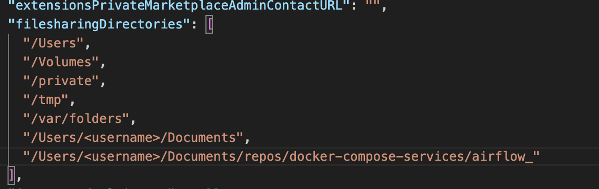

Installing Airflow on MacOS using docker:

Go to the official airflow website: https://airflow.apache.org/docs/apache-airflow/stable/howto/docker-compose/index.html

1. Create an airflow folder in your preferred location
2. Open a terminal in this folder
3. Copy and run the curl command:

```bash
curl -LfO 'https://airflow.apache.org/docs/apache-airflow/2.9.1/docker-compose.yaml'
```

The version might be different, so do cross-check.

On linux/MacOS, run the following to create a .env file with the airflow uid that will be used by airflow

```bash
echo -e "AIRFLOW_UID=$(id -u)" > .env
```

**To start airflow**, we need to start the DB services first, and we will use the flower profile in detached mode to do this

Run this command:

```bash
docker compose --profile flower up -d airflow-init
```

Then run this command to start the airflow service

```bash
docker compose --profile flower up -d
```

> Note that if you are on MacOS, you need to allow airflow create folders in the folder you created in step one above, or you will run into a permission error. To allow airflow create the needed folders, edit the settings.json file found here: /Users/<username>/Library/Group Containers/group.com.docker

To stop the containers, run this command

```bash
docker compose --profile flower down
```

- Add the necessary paths here:
  
- And restart the docker engine when you are done, in order to add it to docker

> Note that if you have created a network, you need to explicitly add it. If the docker compose file is run without creating a network, one will be created automatically but this might not suit your networking needs if you have some custom network setup
